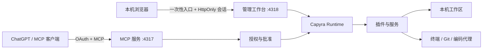

<div align="center">

# Capyra

**让对话中的想法，在你自己的电脑上发生。**

轻量、可组合的本机 AI 能力平台，为 ChatGPT 和其他 MCP 客户端提供工作区、文件、终端、Git、编码代理与插件能力。

[](LICENSE)
[](https://nodejs.org/)
[](https://modelcontextprotocol.io/)
[](package.json)

[快速开始](#快速开始) · [连接 ChatGPT](#连接-chatgpt) · [插件开发](#插件开发) · [安全模型](#安全模型) · [开发文档](#开发文档)

</div>

## Capyra 是什么

Capyra 在本机运行一个 MCP 服务和一个浏览器工作台。AI 客户端提出请求，Capyra 在你选择的工作区内执行，并按照本机设置进行逐次确认或自动批准。文件、命令、Git 状态和任务结果保留在你的电脑上；只有获准返回的内容会发送给客户端。

它适合这些场景：

- 让 ChatGPT 浏览、搜索和修改本机项目。
- 运行命令、交互终端和持续时间较长的任务。
- 查看 Git 差异、历史和隔离 worktree。
- 从同一个对话派发并继续 Codex、Claude、OpenCode、Pi、Cursor、Copilot 或 Grok 编码代理。
- 用自然语言创建、检查、安装和组合 Capyra 插件。
- 通过 stdio、本机 HTTP、Cloudflare Tunnel 或自托管固定 Relay 接入 MCP 客户端。

## 主要能力

| 模块 | 能力 |
|---|---|
| 工作区 | 注册多个目录、系统文件夹选择器、按对话绑定和切换工作区 |
| 文件 | 目录浏览、内容/路径搜索、分页读取、图片读取、SHA 前置条件、精确编辑、补丁、移动和上传 |
| 终端 | 命令执行、后台会话、分页输出、stdin、中断、取消和可选 PTY |
| Git | 状态、差异、历史、文件恢复、worktree、审阅快照和历史审阅恢复 |
| 项目上下文 | 根与嵌套规则、AGENTS/CLAUDE 指令、Skills 发现与资源读取 |
| 编码代理 | 多提供者角色、任务派发、后台进程、原生会话继续、结果和原始输出 |
| 插件 | manifest、权限、依赖、配置、启停、资源释放、外部 MCP 与替换式存储/策略/UI |
| 连接 | OAuth、批准、撤销、暂停、Quick/Named Tunnel、固定 Relay 与分层诊断 |

## 快速开始

### 环境要求

- Node.js 22.16 或更新版本。
- npm 10 或更新版本。
- Git；只使用文件和终端功能时可选。

### 从源码运行

```sh
git clone https://github.com/dxeledx/capyra.git
cd capyra
npm ci
npm run build
node dist/cli.js init
node dist/cli.js start --open
```

`init` 会在当前目录创建 `capyra.json`。`start --open` 启动 MCP 服务并打开带一次性本机认证的管理工作台：

- 本机工作台：`http://127.0.0.1:4318`
- MCP：`http://127.0.0.1:4317/mcp`

重新打开正在运行的工作台：

```sh
node dist/cli.js open
```

安装为全局命令：

```sh
npm install -g .
capyra init
capyra start --open
```

> Capyra 尚未发布到 npm registry。请从本仓库源码安装；registry 中的同名包不代表本项目。

## 第一次使用

1. 在顶部工作区菜单打开“管理工作区”。
2. 点击“选择文件夹”，在系统目录面板中选择项目，然后注册。
3. 在“插件组合”中启用需要的能力并检查权限。
4. 在“待你确认”中选择逐次确认或自动批准，以及结果返回客户端或仅留本机。
5. 使用 stdio，或在“连接 ChatGPT”中准备 HTTPS 入口。

每个 ChatGPT 对话第一次调用 Capyra 时绑定当时的工作区。本机切换默认工作区只影响以后建立的对话；已有对话继续使用原项目。要改变当前对话，直接让 Capyra 列出并选择工作区，无需 reconnect 或新开对话。

## 连接 ChatGPT

ChatGPT 需要能够访问一个 HTTPS MCP 地址。Capyra 提供以下方式：

| 方式 | 适用场景 | 地址稳定性 |
|---|---|---|
| Cloudflare Quick Tunnel | 最快体验，不需要 Cloudflare 账号 | 重新建立后可能变化 |
| 自托管固定 Relay | 长期使用；Relay 主动转发到本机 | 每台设备固定 |
| Cloudflare Named Tunnel | 已有域名和 Cloudflare 配置 | 固定 |
| stdio | 本机 MCP 客户端 | 不使用公网地址 |

### Quick Tunnel

在工作台的“连接 ChatGPT”中选择“快速直连”，让 Capyra 下载并校验官方 `cloudflared`，然后启动连接。页面会给出连接名称、HTTPS MCP 地址和认证方式。

在 ChatGPT 中启用开发者模式并添加自定义应用：

1. 名称填写 `Capyra`。
2. MCP 地址粘贴工作台生成的 HTTPS 地址。
3. 认证方式选择 OAuth。
4. 回到本机工作台批准首次连接。
5. 在对话中选择 Capyra 并发送：“请使用 Capyra 浏览当前工作区，并告诉我有哪些文件。”

Quick Tunnel 的地址可能变化。地址不变时继续使用原连接；地址变化时更新 ChatGPT 中的应用连接。

### 固定 Relay

[`sites-relay/`](sites-relay/) 提供自托管固定入口的参考实现。它使用 D1 保存设备公钥、短时请求和防重放随机数；设备私钥、OAuth 令牌、工作区数据和批准操作留在本机。部署后，在工作台填写 Relay 首页地址和管理员生成的设备接入码。

Relay 地址、接入码和托管项目 ID 不包含在仓库中。详见[固定连接说明](docs/sites-connection.md)和 [Relay 部署说明](sites-relay/README.md)。

### 本机 MCP 客户端

```sh
node /absolute/path/to/capyra/dist/cli.js start \
  --stdio \
  --workspace /path/to/project
```

stdio 模式只在 stdout 输出 MCP 协议；状态写入 stderr。stdin 关闭后实例会释放资源。

## 工作原理



MCP 入口与本机管理入口分别监听。公网连接只转发 MCP 与 OAuth 所需路由，不能调用批准设置或替用户批准请求。

## 批准与结果

- **逐次确认**：读取、搜索、目录、命令和历史结果逐项在本机批准。
- **自动批准**：明确启用后自动执行新请求；仍受 OAuth、工作区、设备范围、暂停和插件策略约束。
- **仅留本机**：任务可以执行，但完整结果不返回客户端。
- **暂停与撤销**：暂停拒绝新请求并中断远程后台任务；撤销使对应 OAuth 令牌和请求失效。

本机“待你确认 → ChatGPT 连接”会列出每条 OAuth 连接，可以添加本机备注、查看创建时间/最后访问/请求数，并单独暂停、恢复或撤销。ChatGPT 不会把登录邮箱或 OpenAI 账号 ID 提供给 MCP 服务，因此备注用于区分个人、工作等连接，不能视为经过 OpenAI 验证的账号身份。

自动批准无法区分共享同一个 ChatGPT 账号的不同操作者。共享账号场景应使用逐次确认，并在不使用时暂停或撤销连接。

## 插件开发

内置功能和外部插件使用同一套 API v1。插件可以注册工具、服务、指令和资源，并声明权限、依赖、配置 schema 与释放逻辑。

```sh
capyra plugin create paper-organizer \
  --prompt "按年份和主题整理论文，并生成索引"

capyra plugin spec --json
capyra plugin validate ./capyra-plugins/paper-organizer --json
capyra plugin install ./capyra-plugins/paper-organizer
capyra plugin enable paper-organizer
```

新插件安装后默认禁用。启用前由本机用户检查 manifest、权限和配置。可运行示例：

- [单词统计工具](examples/word-count.mjs)
- [SQLite 存储替换](examples/sqlite-storage.mjs)
- [严格执行策略](examples/strict-policy.mjs)
- [替换式本机界面](examples/alternate-ui/)

完整契约见[插件开发指南](docs/plugins.md)。

## 编码代理

```sh
capyra agents targets
capyra agents run codex --prompt "Read the project and explain its structure"
capyra agents ls
capyra agents show AGENT_ID
capyra agents continue AGENT_ID --prompt "Continue the previous task"
capyra agents daemon status
```

代理提供者需要相应客户端、SDK 或合法登录。模型调用可能消耗提供者额度；Capyra 不附带第三方账号或 API Key。详见[代理运维](docs/agents-operations.md)。

## 安全模型

Capyra 运行在你的操作系统账号权限下，因此应把它当作本机开发工具：

- 本机工作台使用一次性启动链接、HttpOnly cookie、Host 与同源检查。
- OAuth、Capyra 账号、设备绑定和具体任务批准属于不同安全层。
- 文件工具拒绝目录穿越、受保护配置、符号链接和硬链接别名。
- 写入支持 SHA 前置条件，避免覆盖读取后已经变化的文件。
- 远程请求在批准前不读取文件敏感预览；断连、超时和撤销会使批准失效。
- 原生插件、命令和编码代理拥有当前系统用户可用的权限，批准前应检查目录、命令和内容。
- 密钥、配置、任务状态与设备私钥存放在私有 `.capyra/`，不得提交到 Git。

漏洞报告方式见 [SECURITY.md](SECURITY.md)，实现边界见[安全设计](docs/security-review.md)。

## 配置

默认配置文件是当前目录的 `capyra.json`。常用命令：

```sh
capyra init
capyra doctor
capyra start --open
capyra start --compact
capyra start --tunnel cloudflare
capyra local
```

CLI 完整列表：

```sh
capyra --help
```

## 项目结构

```text
src/            核心运行时、插件、连接、身份和 MCP 传输
public/         本机浏览器工作台
tests/          Node 测试与协议/安全回归
examples/       外部插件与替换式服务示例
schemas/        插件 manifest JSON Schema
cloud/          可选账号与设备服务
sites-relay/    可选固定设备 Relay
docs/           使用、扩展和安全文档
```

## 开发

```sh
npm ci
npm run build
npm test
npm run check
```

提交补丁前请阅读 [CONTRIBUTING.md](CONTRIBUTING.md)。TypeScript 构建输出位于 `dist/`，不提交到仓库。

## 开发文档

- [架构概览](docs/architecture.md)
- [插件开发](docs/plugins.md)
- [连接与运维](docs/connection-operations.md)
- [固定 Relay](docs/sites-connection.md)
- [编码代理](docs/agents-operations.md)
- [Skills 与项目规则](docs/skills.md)
- [MCP Apps 界面](docs/client-ui.md)
- [安全设计](docs/security-review.md)

## 项目状态

Capyra 仍处于 `0.x` 阶段，插件 API 为 v1。macOS 是当前主要开发环境；Windows 和 Linux 代码路径已实现，但跨平台发布前仍需要更多真实设备反馈。

项目的产品能力参考 [DevSpace](https://github.com/Waishnav/devspace)，插件化方向参考 [DeepSeek Harness](https://github.com/deepseek-ai/deepseek-harness)。Capyra 的实现、接口与用户体验均为独立设计。

## 贡献与许可证

欢迎提交 Issue 和 Pull Request。请勿在 Issue、日志或示例中附带真实令牌、私钥、设备地址或工作区内容。

Capyra 使用 [MIT License](LICENSE)。
